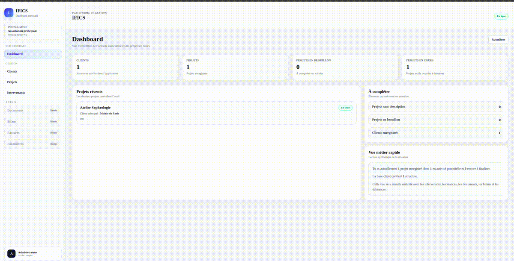

# 🚀 IFICS Dashboard

> Full-stack associative management platform for projects, clients, intervenors and documents.

## 🎬 Demo



---

## 💡 Quick overview

- Client management
- Project tracking
- Document handling (PDF)
- Invoices & quotes (in progress)
- Data-driven dashboard

---

## ⚙️ Tech Stack

- Nuxt 4 / Vue 3
- Node.js 22
- Nitro server API
- Prisma ORM
- PostgreSQL 16 (self-hosted)
- Docker / Docker Compose
- ESLint / TypeScript / Vitest

---

## 🧪 Local setup

1. Clone the repository.
2. Create your local environment file:

```bash
cp .env.example .env
```

3. Replace every placeholder secret in `.env` with a unique local value.
4. Initialize the development stack:

```bash
make dev-init
```

The application is exposed on `http://localhost:3000` by default. `APP_PORT` can be changed in `.env`.

> Never commit `.env` or real credentials. Values that appeared in Git history before Milestone 1.2 must be considered compromised and must not be reused.

### Quality checks

Before proposing a change, run:

```bash
npm run quality
```

The permanent pull-request quality gate also validates deterministic installation, Prisma client generation, lint, Nuxt type checking, Vitest coverage and the production dependency critical-vulnerability threshold.

See:

- `docs/development/docker.md`
- `docs/development/quality.md`
- `docs/security/secrets-management.md`

---

## 📌 Contexte du projet

> Dashboard de gestion associative dédié aux structures éducatives, collectivités et intervenants.

## Contexte

Ce projet est directement issu de mon expérience professionnelle.

De 2021 à 2026, j’ai travaillé en tant que **Responsable Projets et Solutions Digitales** au sein de l’association **IFICS**, spécialisée dans l’éducation et les projets avec les collectivités territoriales.

Au quotidien, j’ai été confronté à des problématiques concrètes :

- gestion complexe des projets
- multiplicité des interlocuteurs (collectivités, établissements scolaires, partenaires)
- suivi des intervenants
- organisation des documents (bilans, conventions, contrats)
- gestion des devis et factures
- absence d’un outil centralisé réellement adapté aux associations

En novembre 2023, j’intègre **l’école 42** afin de me reconvertir dans le développement.

👉 Ce projet est donc la fusion entre :
- mon expérience métier terrain
- mes compétences techniques en cours d’acquisition

---

## Objectif

Créer une application web permettant de :

- centraliser la gestion d’une association
- structurer les projets et les acteurs
- simplifier la gestion administrative et documentaire
- sécuriser les accès aux données sensibles
- proposer un outil réutilisable par d’autres structures

---

## Vision produit

Le projet est conçu comme :

- une **web application**
- **auto-hébergée**
- **une association = une instance**
- **responsive / mobile-first**
- **évolutive et personnalisable**

Objectif long terme :

- outil métier robuste
- solution réutilisable
- produit scalable et distribuable

---

## ⚙️ Fonctionnalités principales

### 👥 Gestion des utilisateurs
- rôles (admin, client, intervenant)
- permissions
- accès temporaires

### Gestion des clients
- collectivités
- établissements scolaires
- associations
- multi-contacts

### Gestion des projets
- statuts (brouillon, validé, en cours, terminé…)
- clients associés
- intervenants
- partenaires
- suivi global

### Gestion des intervenants
- affectation aux projets
- acceptation / refus de mission
- dépôt de documents

### Gestion documentaire
- upload de fichiers (PDF)
- consultation sécurisée
- gestion des accès
- traçabilité

### Devis & Factures *(en cours)*
- génération
- suivi
- export PDF

### Bilans *(en cours)*
- rédaction libre
- versioning
- export

### 🔔 Notifications
- actions importantes
- activité récente

---

## 📂 Structure du projet

- `app/` → Frontend Nuxt (pages, composants)
- `server/` → API backend (routes, logique métier)
- `prisma/` → schéma + migrations base de données
- `public/` → assets statiques
- `tests/` → tests automatisés
- `docs/` → documentation architecture, sécurité et exploitation

---

## 🔐 Sécurité

Le projet est en cours de durcissement dans le cadre du Milestone 1. La cible inclut notamment :

- authentification forte et MFA
- permissions granulaires et scopes
- journal d’audit
- gestion sécurisée des documents
- séparation des données sensibles
- tests automatisés de sécurité et d’autorisation
- environnement auditable

Voir `docs/architecture/current-state.md`, `docs/development/quality.md` et `docs/security/secrets-management.md`.

---

## 🚧 État du projet

⚠️ Projet en développement actif.

### Fonctionnel actuellement

- gestion des projets
- gestion des documents (upload + visualisation PDF)
- API backend structurée
- routing dynamique Nuxt
- environnement Docker DEV reproductible
- lint, typecheck et tests unitaires automatisés

### En cours

- tests de régression API
- socle sécurité / authentification
- amélioration UI/UX
- gestion avancée des rôles
- devis / factures
- notifications

---

## 🚀 Roadmap

Le projet suit maintenant une construction incrémentale par milestones, avec tests et documentation à chaque étape. Le détail du Milestone 1 est documenté dans `docs/architecture/current-state.md`.

---

## 💡 Vision

Créer un outil métier basé sur une vraie expérience terrain, capable d’aider les associations à structurer leur activité et à gagner en efficacité.

---

## 👨‍💻 Auteur

**Van BUI**

- Étudiant à l’école 42
- Responsable Projets & Solutions Digitales

---

## ⚠️ Disclaimer

Projet en développement actif. Certaines fonctionnalités sont encore en cours d’implémentation.
